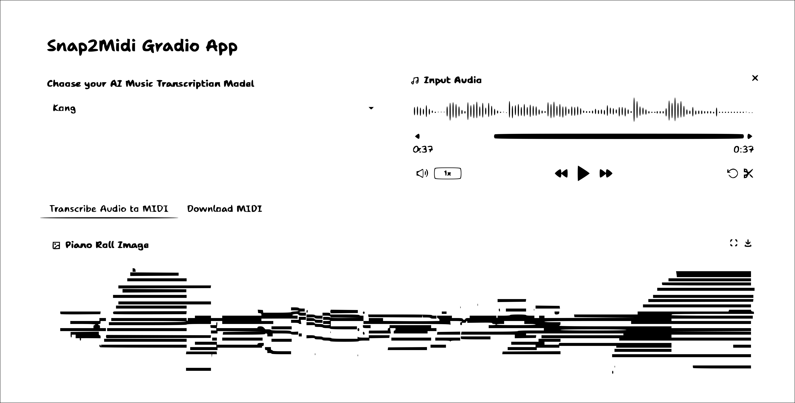

# Snap2MIDI
<p align="center">
  
</p>

Snap2MIDI is a library that converts audio “snapshots” into MIDI. It includes several state-of-the-art (SOTA) models such as Onsets and Frames and Kong. The library is designed for ease of use, allowing users to quickly train these AMT (Automatic Music Transcription) architectures without writing any code. Its codebase is also extensible: by following the established coding paradigm, users can add new datasets and integrate additional AMT models for training.

## Installation for Development Purposes
-  First of all, clone this repo:
    ```
    git clone https://github.com/Nkcemeka/Snap2MIDI.git
    ```

-  Create a virtual environment:
    ```
    python3 -m venv venv
    ```

-  Activate the environment (for example):
    ```
    source ./venv/bin/activate
    ```

-  Go to the root directory and run the following:
    ```
    pip install -e .
    ```

## API Usage
The examples below show you how to use the Snap2MIDI API.
### Data Extraction
```
from snap2midi.extractor import SnapExtractor
import snap2midi as s2m

# init dataset path
dataset_path = "./Datasets/MAPS"
snap_extractor = SnapExtractor()

# perform extraction and use the MAPS dataset
snap_extractor.extract_oaf(dataset_path, dataset_name="maps")
```

### Training
```
from snap2midi import Trainer

trainer = Trainer()
trainer.train_oaf()
```

### Evaluation
```
from snap2midi import Evaluator

evaluator = Evaluator()
evaluator.evaluate_oaf(checkpoint_name="checkpoint_90.pt")
```

### Inference
```
from snap2midi import Inference

inference = Inference()
inference.inference_oaf(audio_path="./Nanana-audio.mp3", checkpoint_path="runs/oaf/checkpoint_90.pt")
```

## Gradio Application
Snap2MIDI has an application interface. 

<p align="center">
  
</p>

However this uses the default checkpoints associated with the library. If you want to use your own trained checkpoints, you need to use the API. To run the application, go to the gradio_app directory and run the ./run.sh file. Make sure you update the file with the correct path to the soundfont file and checkpoint; the pedal checkpoint is optional and only needed for models like KONG. Alternatively, you can try:
```
python app.py --soundfont_path=<SOUNDFONT_PATH> --checkpoint_path=<CHECKPOINT_PATH> --checkpoint_pedal=<CHECKPOINT_PEDAL>
```

You can download the official checkpoints from HuggingFace. You can view the HuggingFace repo here:
```
https://huggingface.co/nkcemeka/Snap2MIDI
```
